# OpenLeap ERP System Overview

This document presents the overall system layout using the agreed four-tier architecture with a Tier-3 split into 6 suites, the domains/subdomains in each suite, and the key event-driven dependencies between them. It also marks Tier-1 sync lookups (REF, I18N, SI, DMS) used by other domains.

Conventions

```mermaid
flowchart TB
  %% ===================== TIER 1 =====================
  subgraph T1[Tier 1 - Platform & Technical Foundations]
    direction TB
    REF[ref / Reference Data<br/>Exchange: ref.ref.events]
    I18N[i18n / Translations<br/>Exchange: i18n.i18n.events]
    SI[si / SI Units<br/>Exchange: si.si.events]
    DMS[dms / Document Mgmt<br/>Exchange: dms.dms.events]
    RPT[rpt / Technical Reporting - PDF<br/>Exchange: t1.rpt.events]
    CFG[cfg / Platform Configuration<br/>Exchange: cfg.cfg.events]
    JC[jc / Job Control<br/>Exchange: jc.jc.events]

    subgraph IAM[IAM - Identity & Access Management]
      direction TB
      PRINCIPAL[principal / Identity<br/>Exchange: iam.principal.events]
      TENANT[tenant / Tenant Mgmt<br/>Exchange: iam.tenant.events]
      AUTHZ[authz / Authorization<br/>Exchange: iam.authz.events]
      AUDIT[audit / Audit<br/>Exchange: iam.audit.events]
    end
  end

  %% ===================== TIER 2 =====================
  subgraph T2[Tier 2 - Shared Enterprise Business]
    direction TB
    BP[bp / Business Partner<br/>Exchange: shared.bp.events]
    CAL[cal / Calender and Planner<br/>Exchange: shared.cal.events]
  end

  %% ===================== TIER 3 =====================
  subgraph T3[Tier 3 - Core Business Suites]
    direction TB

    %% ----- PPS SUITE -----
    subgraph PPS[PPS - Production, Planning & Shopfloor]
      direction TB
      PD[pd - Product Definition<br/>Exchange: pps.pd.events]
      MRP[mrp - Material Requirements Planning<br/>Exchange: pps.mrp.events]
      MES[mes - Manufacturing Execution<br/>Exchange: pps.mes.events]
      APS[aps - Advanced Planning & Scheduling<br/>Exchange: pps.aps.events]
      QM[qm - Quality Management<br/>Exchange: pps.qm.events]
      IM[im - Inventory Management<br/>Exchange: pps.im.events]
      WM[wm - Warehouse Management<br/>Exchange: pps.wm.events]
      PUR[pur - Procurement<br/>Exchange: pps.pur.events]
      EAM[eam - Asset Management<br/>Exchange: pps.eam.events]
      CO_PPS[co - Controlling - if hosted in PPS<br/>Exchange: pps.co.events]
    end

    %% ----- FI SUITE -----
    subgraph FI[FI - Finance & Accounting]
      direction TB
      GL[gl - General Ledger<br/>Exchange: fi.gl.events]
      AP[ap - Accounts Payable<br/>Exchange: fi.ap.events]
      AR[ar - Accounts Receivable<br/>Exchange: fi.ar.events]
      TAX[tax - Tax<br/>Exchange: fi.tax.events]
      PAY[pay - Payments<br/>Exchange: fi.pay.events]
      CO_FI[co - Controlling - if hosted in FI<br/>Exchange: fi.co.events]
    end

    %% ----- SD SUITE -----
    subgraph SD[SD - Sales & Customer Management]
      direction TB
      SDCORE[sd - Sales Core<br/>Exchange: sd.sd.events]
      PRICING[pricing - Pricing<br/>Exchange: sd.pricing.events]
      SD_CRM[crm - CRM<br/>Exchange: sd.crm.events]
    end

    %% ----- HR SUITE -----
    subgraph HR[HR - Human Resources]
      direction TB
      HRCORE[hr - HR Core<br/>Exchange: hr.hr.events]
      TIME[time - Time & Attendance<br/>Exchange: hr.time.events]
    end

    %% ----- PS SUITE -----
    subgraph PS[PS - Project Management]
      direction TB
      PSCORE[ps - Projects<br/>Exchange: ps.ps.events]
    end

    %% ----- CO SUITE -----
    subgraph CO[CO - Controlling]
      direction TB
      ABC[abc - Activity-Based Costing<br/>Exchange: co.abc.events]
      CCA[cca - Cost Center Accounting<br/>Exchange: co.cca.events]
      CO_IO[io - Internal Orders<br/>Exchange: co.io.events]
      CO_PA[pa - Profitability Analysis<br/>Exchange: co.pa.events]
    end

    %% ----- COM SUITE -----
    subgraph COM[COM - Commerce]
      direction TB
      CAT_COM[cat - Catalog<br/>Exchange: com.cat.events]
      CMP[cmp - Campaigns<br/>Exchange: com.cmp.events]
      PRC[prc - Pricing<br/>Exchange: com.prc.events]
      SRCH[srch - Search<br/>Exchange: com.srch.events]
    end

    %% ----- CRM SUITE -----
    subgraph CRM_SUITE[CRM - Customer Relationship Management]
      direction TB
      CONTACT[contact - Contact Mgmt<br/>Exchange: crm.contact.events]
      LEAD[lead - Lead Mgmt<br/>Exchange: crm.lead.events]
      OPPORTUNITY[opportunity - Opportunities<br/>Exchange: crm.opportunity.events]
      ACTIVITY[activity - Activities<br/>Exchange: crm.activity.events]
    end

    %% ----- FAC SUITE -----
    subgraph FAC[FAC - Facilities]
      direction TB
      COL[col - Collections<br/>Exchange: fac.col.events]
      FND[fnd - Foundations<br/>Exchange: fac.fnd.events]
      LIM[lim - Limits<br/>Exchange: fac.lim.events]
      RCV[rcv - Receivables<br/>Exchange: fac.rcv.events]
    end

    %% ----- OPS SUITE -----
    subgraph OPS[OPS - Operations]
      direction TB
      OPS_ORD[ord - Orders<br/>Exchange: ops.ord.events]
      OPS_PRJ[prj - Projects<br/>Exchange: ops.prj.events]
      OPS_SCH[sch - Scheduling<br/>Exchange: ops.sch.events]
      OPS_TSK[tsk - Tasks<br/>Exchange: ops.tsk.events]
    end

    %% ----- SRV SUITE -----
    subgraph SRV[SRV - Service Management]
      direction TB
      SRV_CAS[cas - Cases<br/>Exchange: srv.cas.events]
      SRV_ENT[ent - Entitlements<br/>Exchange: srv.ent.events]
      SRV_SES[ses - Sessions<br/>Exchange: srv.ses.events]
      SRV_BIL[bil - Billing<br/>Exchange: srv.bil.events]
    end
  end

  %% ===================== TIER 4 =====================
  subgraph T4[Tier 4 - Data, Analytics & Integration]
    direction TB
    BI[bi - Data Platform<br/>Exchange: bi.bi.events - Tier-4<br/>HTTP at /api/t4/bi]
  end

  %% ========= Sync lookups from T1 (dotted) =========
  classDef dashedEdge stroke-dasharray: 5 5
  PD -.->|codes/labels/units| REF
  PD -.->|labels| I18N
  PD -.->|units| SI
  PUR -.->|codes/labels| REF
  IM -.->|units| SI
  SDCORE -.->|codes/labels| REF
  HRCORE -.->|codes/labels| REF
  GL -.->|codes| REF
  AP -.->|codes| REF
  AR -.->|pdf templates/render| RPT
  AP -.->|pdf templates/render| RPT
  ABC -.->|codes/labels| REF
  CAT_COM -.->|codes/labels| REF
  CONTACT -.->|codes/labels| REF
  COL -.->|codes/labels| REF
  OPS_ORD -.->|codes/labels| REF
  SRV_CAS -.->|codes/labels| REF

  %% ========= Event-driven dependencies (solid) =========
  %% PD releases drive planning, procurement, execution, quality, inventory
  PD -->|pps.pd.product.released| MRP
  PD -->|pps.pd.product.released| PUR
  PD -->|pps.pd.productionversion.released| MES
  PD -->|pps.pd.bom.released| QM
  PD -->|pps.pd.product.released| IM

  %% MRP proposals to PUR
  MRP -->|pps.mrp.purchaseproposal.created| PUR

  %% PUR lifecycle to IM/WM; ASN to WM (optional), PO to IM expectations
  PUR -->|pps.pur.purchaseorder.created| IM
  PUR -->|pps.pur.asn.created| WM

  %% Goods Receipt from IM informs PUR (status) and can trigger QM
  IM -->|pps.im.goodsreceipt.posted| PUR
  IM -->|pps.im.goodsreceipt.posted| QM

  %% SD triggers delivery which IM consumes to post GI
  SDCORE -->|sd.sd.delivery.created| IM

  %% Billing from SD informs FI (AR)
  SDCORE -->|sd.sd.billing.created| AR

  %% FI events relevant to PUR (AP invoice posted)
  AP -->|fi.ap.invoice.posted| PUR

  %% MES confirmations/movements to IM
  MES -->|pps.mes.confirmation.posted| IM

  %% BP master data to other domains
  BP -->|bp.bp.party.created| PUR
  BP -->|bp.bp.party.created| SDCORE
  BP -->|bp.bp.party.created| HRCORE
  BP -->|bp.bp.party.created| AP

  %% IM/WM may signal stock/warehouse events to MES/SD (illustrative)
  IM -->|pps.im.stock.changed| MES
  WM -->|pps.wm.pickwave.released| SDCORE

  %% Tier 4 BI consumes all events (shown with one representative edge)
  PD -->|events| BI
  PUR -->|events| BI
  IM -->|events| BI
  SDCORE -->|events| BI
  AP -->|events| BI
  BP -->|events| BI

```

- Exchanges: `<suite>.<domain>.events` (topic)
- Routing keys: `<suite>.<domain>.<aggregate>.<event>`
- API base paths: `/api/<suite>/<domain>/v1`

Notes
- BI is not part of Tier‑3; it lives in Tier‑4 and passively consumes events from all suites.
- CO (Controlling) can live in FI or PPS depending on governance. Keep its own prefix and exchange: `fi.co.events` or `pps.co.events`. CO is also modeled as a standalone suite (`co.*`) for deployments that prefer suite-level separation.
- Tier‑1 services are primarily used via synchronous reads (dashed arrows). They may emit update events (not elaborated here).
- IAM (Identity & Access Management) is a cross-cutting T1 dependency: all services depend on IAM for authentication and authorization. To keep the diagram readable, IAM auth arrows are not drawn individually.
- Event arrows are illustrative and focus on key flows already present in contracts (e.g., `pps.pd.product.released`, `pps.pur.purchaseorder.created`, `pps.im.goodsreceipt.posted`, `sd.sd.billing.created`, `fi.ap.invoice.posted`, `bp.bp.party.created`).
- New T3 suites (CO, COM, CRM, FAC, OPS, SRV) show 3-4 representative domains each; full domain lists are in `spec/OPENLEAP_PLATFORM_GENERAL.md`.
