# OpenLeap ERP Platform — General Documentation

Last updated: 2026-04-01

This document provides a concise, product-agnostic overview of the OpenLeap ERP platform. It explains the four-tier architecture, outlines typical suites and domains in each tier, and describes the platform-wide communication patterns: synchronous APIs for data access and asynchronous eventing (RabbitMQ) for business-change notifications.

## 1. Four-Tier Architecture

OpenLeap adopts a pragmatic four-tier architecture to separate technical foundations, shared enterprise capabilities, core business execution, and analytical/integration concerns.

- Tier 1 — Platform & Technical Foundations (T1)
  - Purpose: Provide shared, low-level platform services and reference data needed across the enterprise. These services are highly stable, read-optimized, and accessed synchronously by higher tiers.
  - Characteristics: Small, focused services; strong backward compatibility; high availability; multi-tenant aware (where applicable).

- Tier 2 — Shared Enterprise Business (T2)
  - Purpose: House cross-cutting enterprise master data and shared business capabilities (e.g., Business Partner). Provides authoritative sources consumed across suites in Tier 3.
  - Characteristics: Enterprise-governed domains; consistent identifiers; lifecycle events published for downstream consumers.

- Tier 3 — Core Business Suites (T3)
  - Purpose: Deliver the operational core of the ERP. Organized into suites (e.g., PPS, FI, SD), each containing multiple business domains.
  - Characteristics: Rich domain models; orchestrate end-to-end processes; emit domain events; depend on T1 synchronously and on T2/T3 asynchronously where appropriate.

- Tier 4 — Data, Analytics & Integration (T4)
  - Purpose: Provide data platform, analytics, and external integration capabilities. Consumes events from all tiers and exposes curated data products.
  - Characteristics: Event ingestion at scale; schema-on-write/read per use case; minimal coupling to operational workflows.

## 2. Typical Suites and Domains per Tier

Below are representative (non-exhaustive) suites and domains used across OpenLeap. Actual deployments can tailor these lists.

### 2.1 Tier 1 — Platform & Technical Foundations (T1)
- ref — Reference Data (codes, classifications, catalogs)
- i18n — Internationalization (labels, translations)
- si — Units of Measure (SI units, conversions)
- dms — Document Management (file storage, metadata, rendition)
- rpt — Technical Reporting Utilities (PDF rendering and templates)
- cfg — Platform Configuration (feature flags, application settings)
- jc — Job Control (async job scheduling and monitoring)
- iam — Identity & Access Management (principal, tenant, authz, audit)

Access pattern: Primarily synchronous lookups from higher tiers (e.g., resolve codes, labels, units, templates). These services may also emit update events when reference data changes, but most consumers rely on on-demand reads.

### 2.2 Tier 2 — Shared Enterprise Business (T2)
- bp — Business Partner (parties, organizations, contacts)
- cal — Calendar & Planner (working calendars, capacity calendars)

Access pattern: Authoritative master data with both synchronous APIs (for queries/CRUD as allowed) and asynchronous lifecycle events (e.g., `bp.party.created`).

### 2.3 Tier 3 — Core Business Suites (T3)

Suites group cohesive operational domains. Common suites include:

- PPS — Production, Planning & Shopfloor
  - pd — Product Definition (materials, BOM, routings, production versions)
  - mrp — Material Requirements Planning (supply proposals)
  - mes — Manufacturing Execution (confirmations, shopfloor operations)
  - aps — Advanced Planning & Scheduling
  - qm — Quality Management
  - im — Inventory Management (stock, goods movements)
  - wm — Warehouse Management (picking, putaway, waves)
  - pur — Procurement (suppliers, purchase orders, ASN)
  - eam — Enterprise Asset Management
  - co — Controlling (if hosted within PPS in a given deployment)

- FI — Finance & Accounting
  - gl — General Ledger
  - ap — Accounts Payable
  - ar — Accounts Receivable
  - tax — Tax
  - pay — Payments
  - co — Controlling (if hosted within FI in a given deployment)

- SD — Sales & Customer Management
  - sd — Sales Core (orders, deliveries, billing)
  - pricing — Pricing
  - crm — CRM

- HR — Human Resources
  - hr — Core HR
  - time — Time & Attendance

- PS — Project Management
  - ps — Projects (WBS, activities)

- CO — Controlling
  - abc — Activity-Based Costing
  - cca — Cost Center Accounting
  - io — Internal Orders
  - om — Overhead Management
  - pa — Profitability Analysis
  - pc — Product Costing
  - pca — Profit Center Accounting
  - rpt — Reporting

- COM — Commerce
  - cat — Catalog
  - cmp — Campaigns
  - lst — Listings
  - mpx — Marketplace Exchange
  - prc — Pricing
  - srch — Search

- CRM — Customer Relationship Management
  - contact — Contact Management
  - lead — Lead Management
  - opportunity — Opportunities
  - activity — Activities
  - email — Email Integration
  - workflow — Workflow Automation
  - notification — Notifications
  - calendar — Calendar
  - reporting — Reporting

- FAC — Facilities
  - col — Collections
  - fnd — Foundations
  - lim — Limits
  - rcv — Receivables
  - rsk — Risk

- OPS — Operations / Field Service
  - doc — Documents
  - ord — Orders
  - prj — Projects
  - res — Resources
  - sch — Scheduling
  - svc — Services
  - tim — Time Tracking
  - tsk — Tasks

- SRV — Service Management
  - apt — Appointments
  - bil — Billing
  - cas — Cases
  - cat — Catalog
  - ent — Entitlements
  - res — Resources
  - ses — Sessions

Access pattern: Rich domain APIs (synchronous) and high-value business events (asynchronous) published per domain.

### 2.4 Tier 4 — Data, Analytics & Data Activation (T4)

This section is a summary. The full structure — three pillars, ~19 domains, SPLE platform/product split, integration decomposition across T1 + T3 + products, citations — is in [t4-structure.md](t4-structure.md).

Pillars and sample domains:

- **Data Platform** — `t4.lake`, `t4.stream`, `t4.warehouse`, `t4.catalog`, `t4.contracts`, `t4.quality`, `t4.governance`, `t4.privacy`, `t4.mdm`, `t4.sharing`
- **Analytics & AI** — `t4.metrics`, `t4.bi`, `t4.explore`, `t4.features`, `t4.mlops`, `t4.serving`, `t4.agents` (provisional)
- **Data Activation** — `t4.reverse`, `t4.products`

Access pattern: Primarily event-driven ingestion from all tiers; curated datasets exposed as data products (ODCS/ODPS contracts); HTTP APIs for data-product access and governed extracts; `t4.reverse` writes back to T3 only via public T3 APIs.

Not in T4: **process integration** (iPaaS, EDI, B2B) decomposes across T1 (technical plumbing), T3 suites (semantic connectors via a proposed `{suite}.int.*` sub-namespace), and `prod.*` repos (customer-specific bindings). See [t4-structure.md §4](t4-structure.md).

## 3. Naming Conventions and Endpoints

To ensure interoperability and discoverability, OpenLeap follows consistent naming for APIs and events:

- HTTP API base paths: `/api/<suite>/<domain>/v1`
  - Examples: `/api/pps/pd/v1`, `/api/fi/ap/v1`, `/api/t1/ref/v1`

- Event exchanges (RabbitMQ topic exchanges): `<suite>.<domain>.events`
  - Examples: `pps.pd.events`, `fi.ap.events`, `shared.bp.events`, `i18n.i18n.events`

- Routing keys: `<suite>.<domain>.<aggregate>.<event>`
  - Examples: `pps.pd.product.released`, `pps.im.goodsreceipt.posted`, `sd.sd.billing.created`, `fi.ap.invoice.posted`, `bp.bp.party.created`

## 4. Communication Patterns

OpenLeap combines synchronous communication for data access with asynchronous messaging for change notifications and cross-domain process choreography.

### 4.1 Synchronous communication — for data lookup and transactional APIs
- When to use:
  - Read reference/master data on demand (e.g., resolve code → label via T1 `ref`, fetch units via T1 `si`).
  - Execute transactional commands within a domain boundary (CRUD as allowed, posting movements, confirming operations).
  - Retrieve current state snapshots (e.g., stock by location, BP profile).
- Protocols: HTTP/REST with JSON as default; gRPC may be used for internal high-throughput cases (optional).
- Semantics:
  - Request-response; clients handle retries with exponential backoff.
  - Idempotency keys recommended for mutating operations.
  - Strong validation and clear error models (4xx client errors, 5xx server errors).

### 4.2 Asynchronous communication — for events and notifications (RabbitMQ)
- When to use:
  - Publish domain events representing facts that happened (e.g., product released, PO created, goods receipt posted, invoice posted).
  - Notify interested domains in other suites; enable eventual consistency and decoupled reactions.
  - Feed Tier 4 BI for analytics at scale.
- Infrastructure: RabbitMQ topic exchanges per domain: `<suite>.<domain>.events`.
- Contracts:
  - Routing keys follow `<suite>.<domain>.<aggregate>.<event>`.
  - Event schemas are versioned; backward-compatible changes preferred.
  - Producers own event definitions; consumers validate and evolve adapters.
- Delivery semantics:
  - At-least-once delivery; consumers must be idempotent.
  - Durable queues and dead-letter strategy for poison messages.
  - Ordering is not guaranteed across aggregates; avoid relying on global order.

### 4.3 Pattern synergy and examples
- T1 synchronous lookups (dashed dependency) from higher tiers:
  - `pps.pd` → `t1.ref` for codes and labels; `t1.si` for units; `t1.i18n` for translations; `t1.dms`/`t1.rpt` for templates/PDF rendering.
- Cross-suite event flows (solid dependency):
  - `pps.pd.product.released` → drives `pps.mrp`, `pps.pur`, `pps.mes`, `pps.qm`, `pps.im`.
  - `pps.mrp.purchaseproposal.created` → informs `pps.pur`.
  - `pps.pur.purchaseorder.created` → sets expectations in `pps.im`; `pps.pur.asn.created` → `pps.wm`.
  - `pps.im.goodsreceipt.posted` → informs `pps.pur` and can trigger `pps.qm`.
  - `sd.sd.delivery.created` → consumed by `pps.im` for goods issue.
  - `sd.sd.billing.created` → consumed by `fi.ar` (financial posting).
  - `fi.ap.invoice.posted` → consumed by `pps.pur` (3-way match lifecycle).
  - `bp.bp.party.created` → consumed by `pps.pur`, `sd.sd`, `hr.hr`, `fi.ap`.
  - Tier 4 `bi` consumes events from all suites for analytics.

## 5. Governance, Versioning, and Compatibility
- API versioning in path (`/v1`, `/v2`); additive changes are preferred. Breaking changes require a new major version.
- Event versioning via schema evolution and semantic version in headers/payload; support dual-publish during transitions.
- Backward compatibility guarantees documented per domain; sunset windows for deprecated fields.
- Contract-first development: OpenAPI for HTTP; AsyncAPI for event streams.

## 6. Reliability and Operations
- Error handling: Clear error contracts; circuit breakers and timeouts for sync calls; DLQ monitoring for async.
- Idempotency: Required for event consumers and recommended for mutating HTTP calls.
- Observability: Structured logging with correlation IDs, metrics (latency, throughput, error rates), distributed tracing across sync and async hops.
- Security: AuthN/Z mediated by API gateway/service mesh; least-privilege for message broker access; data protection at rest and in transit.

## 7. Example Developer Checklist
- Before adding a new sync dependency, prefer T1 lookups; avoid tight coupling to T3 services.
- Before adding an event, confirm it is a business fact, not a command; define a clear event name and schema.
- Ensure idempotent handlers and resilient consumers (retry, backoff, DLQ).
- Update diagrams in `spec/SYSTEM_OVERVIEW.md` if topology changes.

## 8. References
- System overview diagram: `spec/SYSTEM_OVERVIEW.md` (Mermaid flowchart with tiers, suites, domains, and dependencies)
- Tier specs: `spec/T1_Platform`, `spec/T2_SharedBusiness`, `spec/T3_Domains`, `spec/T4_Data`
- Specification templates: `concepts/templates/platform/`
- Open tasks: `todo/`

## 9. System Overview (inlined)

This section inlines the content of `spec/SYSTEM_OVERVIEW.md` for convenience. The standalone file remains the source of truth for the diagram and may be updated independently.

Conventions

```mermaid
flowchart TB
  %% ===================== TIER 1 =====================
  subgraph T1[Tier 1 - Platform & Technical Foundations]
    direction TB
    REF[ref / Reference Data<br/>Exchange: ref.ref.events]
    I18N[i18n / Translations<br/>Exchange: i18n.i18n.events]
    SI[si / SI Units<br/>Exchange: si.si.events]
    DMS[dms / Document Mgmt<br/>Exchange: dms.dms.events]
    RPT[rpt / Technical Reporting - PDF<br/>Exchange: t1.rpt.events]
    CFG[cfg / Platform Configuration<br/>Exchange: cfg.cfg.events]
    JC[jc / Job Control<br/>Exchange: jc.jc.events]

    subgraph IAM[IAM - Identity & Access Management]
      direction TB
      PRINCIPAL[principal / Identity<br/>Exchange: iam.principal.events]
      TENANT[tenant / Tenant Mgmt<br/>Exchange: iam.tenant.events]
      AUTHZ[authz / Authorization<br/>Exchange: iam.authz.events]
      AUDIT[audit / Audit<br/>Exchange: iam.audit.events]
    end
  end

  %% ===================== TIER 2 =====================
  subgraph T2[Tier 2 - Shared Enterprise Business]
    direction TB
    BP[bp / Business Partner<br/>Exchange: shared.bp.events]
    CAL[cal / Calender and Planner<br/>Exchange: shared.cal.events]
  end

  %% ===================== TIER 3 =====================
  subgraph T3[Tier 3 - Core Business Suites]
    direction TB

    %% ----- PPS SUITE -----
    subgraph PPS[PPS - Production, Planning & Shopfloor]
      direction TB
      PD[pd - Product Definition<br/>Exchange: pps.pd.events]
      MRP[mrp - Material Requirements Planning<br/>Exchange: pps.mrp.events]
      MES[mes - Manufacturing Execution<br/>Exchange: pps.mes.events]
      APS[aps - Advanced Planning & Scheduling<br/>Exchange: pps.aps.events]
      QM[qm - Quality Management<br/>Exchange: pps.qm.events]
      IM[im - Inventory Management<br/>Exchange: pps.im.events]
      WM[wm - Warehouse Management<br/>Exchange: pps.wm.events]
      PUR[pur - Procurement<br/>Exchange: pps.pur.events]
      EAM[eam - Asset Management<br/>Exchange: pps.eam.events]
      CO_PPS[co - Controlling - if hosted in PPS<br/>Exchange: pps.co.events]
    end

    %% ----- FI SUITE -----
    subgraph FI[FI - Finance & Accounting]
      direction TB
      GL[gl - General Ledger<br/>Exchange: fi.gl.events]
      AP[ap - Accounts Payable<br/>Exchange: fi.ap.events]
      AR[ar - Accounts Receivable<br/>Exchange: fi.ar.events]
      TAX[tax - Tax<br/>Exchange: fi.tax.events]
      PAY[pay - Payments<br/>Exchange: fi.pay.events]
      CO_FI[co - Controlling - if hosted in FI<br/>Exchange: fi.co.events]
    end

    %% ----- SD SUITE -----
    subgraph SD[SD - Sales & Customer Management]
      direction TB
      SDCORE[sd - Sales Core<br/>Exchange: sd.sd.events]
      PRICING[pricing - Pricing<br/>Exchange: sd.pricing.events]
      SD_CRM[crm - CRM<br/>Exchange: sd.crm.events]
    end

    %% ----- HR SUITE -----
    subgraph HR[HR - Human Resources]
      direction TB
      HRCORE[hr - HR Core<br/>Exchange: hr.hr.events]
      TIME[time - Time & Attendance<br/>Exchange: hr.time.events]
    end

    %% ----- PS SUITE -----
    subgraph PS[PS - Project Management]
      direction TB
      PSCORE[ps - Projects<br/>Exchange: ps.ps.events]
    end

    %% ----- CO SUITE -----
    subgraph CO[CO - Controlling]
      direction TB
      ABC[abc - Activity-Based Costing<br/>Exchange: co.abc.events]
      CCA[cca - Cost Center Accounting<br/>Exchange: co.cca.events]
      CO_IO[io - Internal Orders<br/>Exchange: co.io.events]
      CO_PA[pa - Profitability Analysis<br/>Exchange: co.pa.events]
    end

    %% ----- COM SUITE -----
    subgraph COM[COM - Commerce]
      direction TB
      CAT_COM[cat - Catalog<br/>Exchange: com.cat.events]
      CMP[cmp - Campaigns<br/>Exchange: com.cmp.events]
      PRC[prc - Pricing<br/>Exchange: com.prc.events]
      SRCH[srch - Search<br/>Exchange: com.srch.events]
    end

    %% ----- CRM SUITE -----
    subgraph CRM_SUITE[CRM - Customer Relationship Management]
      direction TB
      CONTACT[contact - Contact Mgmt<br/>Exchange: crm.contact.events]
      LEAD[lead - Lead Mgmt<br/>Exchange: crm.lead.events]
      OPPORTUNITY[opportunity - Opportunities<br/>Exchange: crm.opportunity.events]
      ACTIVITY[activity - Activities<br/>Exchange: crm.activity.events]
    end

    %% ----- FAC SUITE -----
    subgraph FAC[FAC - Facilities]
      direction TB
      COL[col - Collections<br/>Exchange: fac.col.events]
      FND[fnd - Foundations<br/>Exchange: fac.fnd.events]
      LIM[lim - Limits<br/>Exchange: fac.lim.events]
      RCV[rcv - Receivables<br/>Exchange: fac.rcv.events]
    end

    %% ----- OPS SUITE -----
    subgraph OPS[OPS - Operations]
      direction TB
      OPS_ORD[ord - Orders<br/>Exchange: ops.ord.events]
      OPS_PRJ[prj - Projects<br/>Exchange: ops.prj.events]
      OPS_SCH[sch - Scheduling<br/>Exchange: ops.sch.events]
      OPS_TSK[tsk - Tasks<br/>Exchange: ops.tsk.events]
    end

    %% ----- SRV SUITE -----
    subgraph SRV[SRV - Service Management]
      direction TB
      SRV_CAS[cas - Cases<br/>Exchange: srv.cas.events]
      SRV_ENT[ent - Entitlements<br/>Exchange: srv.ent.events]
      SRV_SES[ses - Sessions<br/>Exchange: srv.ses.events]
      SRV_BIL[bil - Billing<br/>Exchange: srv.bil.events]
    end
  end

  %% ===================== TIER 4 =====================
  subgraph T4[Tier 4 - Data, Analytics & Integration]
    direction TB
    BI[bi - Data Platform<br/>Exchange: bi.bi.events - Tier-4<br/>HTTP at /api/t4/bi]
  end

  %% ========= Sync lookups from T1 (dotted) =========
  classDef dashedEdge stroke-dasharray: 5 5
  PD -.->|codes/labels/units| REF
  PD -.->|labels| I18N
  PD -.->|units| SI
  PUR -.->|codes/labels| REF
  IM -.->|units| SI
  SDCORE -.->|codes/labels| REF
  HRCORE -.->|codes/labels| REF
  GL -.->|codes| REF
  AP -.->|codes| REF
  AR -.->|pdf templates/render| RPT
  AP -.->|pdf templates/render| RPT
  ABC -.->|codes/labels| REF
  CAT_COM -.->|codes/labels| REF
  CONTACT -.->|codes/labels| REF
  COL -.->|codes/labels| REF
  OPS_ORD -.->|codes/labels| REF
  SRV_CAS -.->|codes/labels| REF

  %% ========= Event-driven dependencies (solid) =========
  %% PD releases drive planning, procurement, execution, quality, inventory
  PD -->|pps.pd.product.released| MRP
  PD -->|pps.pd.product.released| PUR
  PD -->|pps.pd.productionversion.released| MES
  PD -->|pps.pd.bom.released| QM
  PD -->|pps.pd.product.released| IM

  %% MRP proposals to PUR
  MRP -->|pps.mrp.purchaseproposal.created| PUR

  %% PUR lifecycle to IM/WM; ASN to WM (optional), PO to IM expectations
  PUR -->|pps.pur.purchaseorder.created| IM
  PUR -->|pps.pur.asn.created| WM

  %% Goods Receipt from IM informs PUR (status) and can trigger QM
  IM -->|pps.im.goodsreceipt.posted| PUR
  IM -->|pps.im.goodsreceipt.posted| QM

  %% SD triggers delivery which IM consumes to post GI
  SDCORE -->|sd.sd.delivery.created| IM

  %% Billing from SD informs FI (AR)
  SDCORE -->|sd.sd.billing.created| AR

  %% FI events relevant to PUR (AP invoice posted)
  AP -->|fi.ap.invoice.posted| PUR

  %% MES confirmations/movements to IM
  MES -->|pps.mes.confirmation.posted| IM

  %% BP master data to other domains
  BP -->|bp.bp.party.created| PUR
  BP -->|bp.bp.party.created| SDCORE
  BP -->|bp.bp.party.created| HRCORE
  BP -->|bp.bp.party.created| AP

  %% IM/WM may signal stock/warehouse events to MES/SD (illustrative)
  IM -->|pps.im.stock.changed| MES
  WM -->|pps.wm.pickwave.released| SDCORE

  %% Tier 4 BI consumes all events (shown with one representative edge)
  PD -->|events| BI
  PUR -->|events| BI
  IM -->|events| BI
  SDCORE -->|events| BI
  AP -->|events| BI
  BP -->|events| BI

```

- Exchanges: `<suite>.<domain>.events` (topic)
- Routing keys: `<suite>.<domain>.<aggregate>.<event>`
- API base paths: `/api/<suite>/<domain>/v1`

Notes
- BI is not part of Tier‑3; it lives in Tier‑4 and passively consumes events from all suites.
- CO (Controlling) can live in FI or PPS depending on governance. Keep its own prefix and exchange: `fi.co.events` or `pps.co.events`. CO is also modeled as a standalone suite (`co.*`) for deployments that prefer suite-level separation.
- Tier‑1 services are primarily used via synchronous reads (dashed arrows). They may emit update events (not elaborated here).
- IAM (Identity & Access Management) is a cross-cutting T1 dependency: all services depend on IAM for authentication and authorization. To keep the diagram readable, IAM auth arrows are not drawn individually.
- Event arrows are illustrative and focus on key flows already present in contracts (e.g., `pps.pd.product.released`, `pps.pur.purchaseorder.created`, `pps.im.goodsreceipt.posted`, `sd.sd.billing.created`, `fi.ap.invoice.posted`, `bp.bp.party.created`).
- New T3 suites (CO, COM, CRM, FAC, OPS, SRV) show 3-4 representative domains each; full domain lists are in `spec/OPENLEAP_PLATFORM_GENERAL.md`.
