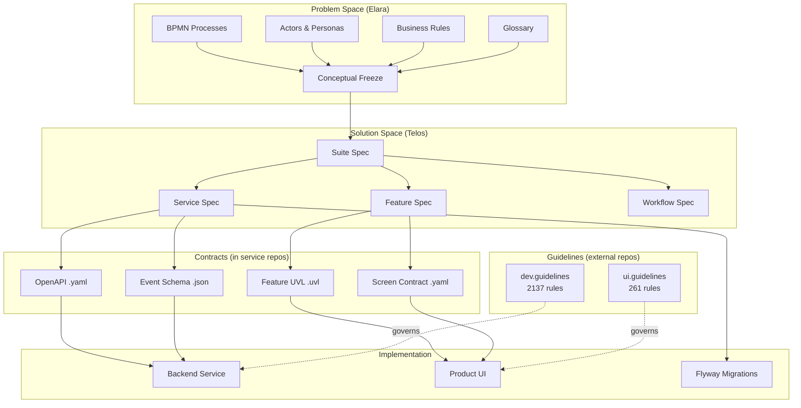

# Integration Map — Specification System

Last updated: 2026-04-01

This document formalizes how specifications, contracts, guidelines, and implementations relate to each other. It defines the specification lifecycle, artifact dependency rules, consistency requirements, and provides checklists for common operations.

---

## 1. Specification Lifecycle

Every domain artifact progresses through six stages. Each stage has a responsible tool, an output artifact, and a defined location.

```
 ┌──────────┐    ┌──────────┐    ┌───────────┐    ┌──────────┐    ┌──────────────┐    ┌────────────┐
 │ DISCOVER │───▶│  FREEZE  │───▶│  SPECIFY  │───▶│ CONTRACT │───▶│  IMPLEMENT   │───▶│  VALIDATE  │
 │ (Elara)  │    │ (Elara)  │    │  (Telos)  │    │ (Derive) │    │ (Dev Team)   │    │ (CI/CD)    │
 └──────────┘    └──────────┘    └───────────┘    └──────────┘    └──────────────┘    └────────────┘
   Processes       Conceptual      Suite Spec       OpenAPI        Java service         CDC tests
   Actors          Freeze          Service Spec     AsyncAPI       Nuxt UI              ArchUnit
   Rules           Artifact        Feature Spec     JSON Schema    Flyway migrations    Ontology
   Domains                         Workflow Spec    UVL                                 Spectral
```

### Stage Details

| # | Stage | Tool | Input | Output | Location |
|---|-------|------|-------|--------|----------|
| 1 | Discover | Elara | Domain expert knowledge | Processes, actors, rules, glossary, KPIs | Elara MongoDB |
| 2 | Freeze | Elara | Discovered artifacts | Conceptual Freeze artifact | Elara → Telos import |
| 3 | Specify | Telos | Freeze + existing catalog | Suite/Service/Feature/Workflow Specs | `io.openleap.spec/spec/` |
| 4 | Contract | Derived | Service Spec | OpenAPI, AsyncAPI, JSON Schema, UVL | Service implementation repos |
| 5 | Implement | Dev Team | Spec + Contract + Guidelines | Service code, UI code, migrations | `io.openleap.{suite}.{domain}` |
| 6 | Validate | CI/CD | Implementation | Test results, compliance reports | Per service repo CI |

**Shortcut paths:**
- For new services in established suites, stages 1–2 may be skipped if the domain is already well-understood.
- For contract-first development, stage 4 may precede stage 3 (OpenAPI designed first, then spec written around it).
- For prototyping, stages 5–6 may run concurrently with stage 3.

---

## 2. Artifact Dependency Graph

Artifacts reference each other in a directed dependency graph. Upstream changes may require downstream updates.



### Dependency Direction Rules

| If you change... | You MUST also update... |
|-----------------|----------------------|
| A **Suite Spec** | Affected Service Specs, Feature Specs |
| A **Service Spec** | OpenAPI and AsyncAPI contracts in the service implementation repo |
| A **Service Spec** aggregate/event | Downstream consumer Service Specs that reference the event |
| A **Feature Spec** | The matching Feature UVL if variability changed |
| The **Tier** of a service | `landscape/REPO_CATALOG.yaml` |

---

## 3. Consistency Rules

These rules define what "consistent" means for the specification system. Phase 5 verification checks all of these.

### 3.1 Specification Coverage

| Rule ID | Rule | Verification |
|---------|------|-------------|
| SC-01 | Every active backend service repo MUST have a Service Spec in `io.openleap.spec/spec/` | Cross-check `REPO_CATALOG.yaml` (category: backend-service, status: active) against `spec/` directory |
| SC-02 | Every Service Spec MUST have at least one OpenAPI contract in its implementation repo | List specs, check for matching contract in service repo |
| SC-03 | Every service that publishes events MUST have event schemas in its implementation repo | Check Service Spec "outbound events" section against service repo contracts |
| SC-04 | Every service in `REPO_CATALOG.yaml` MUST correspond to a Service Spec | Cross-check REPO_CATALOG.yaml entries against spec files |

### 3.2 Contract Integrity

| Rule ID | Rule | Verification |
|---------|------|-------------|
| CI-01 | All OpenAPI/AsyncAPI files MUST include vendor extensions: `x-owner`, `x-suite`, `x-domain`, `x-service` | Spectral lint in service repo CI |
| CI-02 | Event routing keys in AsyncAPI MUST follow `<suite>.<domain>.<aggregate>.<event>` pattern | Regex validation in service repo CI |

### 3.3 Cross-Reference Integrity

| Rule ID | Rule | Verification |
|---------|------|-------------|
| XR-01 | No document MUST reference a file path that does not exist | Parse all `[text](path)` links, check existence |
| XR-02 | No CLAUDE.md MUST reference directories or files that have been removed | Read all CLAUDE.md files, verify paths |
| XR-03 | Feature IDs (`F-{SUITE}-{NNN}`) used in Product Configs MUST exist in the Feature Catalog | Cross-check Elara feature selections against Telos catalog |

### 3.4 Naming Consistency

| Rule ID | Rule | Verification |
|---------|------|-------------|
| NC-01 | Suite codes MUST be lowercase in contracts and service repos, uppercase in `spec/T3_Domains/` | Pattern check across directories |
| NC-02 | API base paths MUST follow `/api/<suite>/<domain>/v1` | OpenAPI basePath/servers check |
| NC-03 | Event exchanges MUST follow `<suite>.<domain>.events` | AsyncAPI channel name check |
| NC-04 | DB schema names MUST follow `<suite>_<domain>` | Service Spec data model section check |

### 3.5 Terminology Consistency

| Rule ID | Rule | Verification |
|---------|------|-------------|
| TC-01 | The terms Suite, Product, Feature, Domain, Service, Tier, Layer, Space MUST be used according to the definitions in `concepts/RECONCILIATION.md` §3 | Manual review |
| TC-02 | The Agora spec tier model MUST match the platform spec tier model (both T1–T4) | Compare §3 in both documents |

---

## 4. Spec Authority Governance

### 4.1 Canonical Source Rule

**`io.openleap.spec/spec/`** is the single source of truth for all domain specifications.

Service repos may contain:
- **OpenAPI specs** (`spec/openapi.yaml` or `spec/openapi.json`) — these are *derived copies* for development convenience (IDE tooling, code generation). When conflicts arise, `io.openleap.spec/spec/` takes precedence.
- **Local CLAUDE.md** — describes the service implementation, not the domain specification. These reference the spec repo for domain knowledge.

### 4.2 Update Flow

```
io.openleap.spec/spec/{domain}.md        ← Authoritative domain spec
        │
        └──▶ io.openleap.{service}/spec/  ← Derived contracts (development convenience)
```

When updating a specification:
1. Update the spec in `io.openleap.spec/spec/`
2. Update or regenerate contracts in the service implementation repo
3. If the service repo has a local copy of the spec, update it (or flag it as stale)

---

## 5. Checklists

### 5.1 Adding a New Domain Service (End-to-End)

- [ ] **Suite Spec exists** — Verify the parent suite has a spec at `spec/T3_Domains/{SUITE}/_*_suite.md`. Create one from `concepts/templates/` if missing.
- [ ] **Service Spec** — Create `spec/T3_Domains/{SUITE}/{suite}_{domain}.md` using the domain spec template in `concepts/templates/`
- [ ] **Repo catalog** — Add entry to `landscape/REPO_CATALOG.yaml`
- [ ] **Service repo** — Create `io.openleap.{suite}.{domain}` from starter template with parent POM `io.openleap.parent`
- [ ] **OpenAPI contract** — Create `openapi.yaml` in the service repo with required vendor extensions
- [ ] **Event schemas** — Create event schemas in the service repo for each published event

### 5.2 Adding a New Feature

- [ ] **Feature ID** — Assign `F-{SUITE}-{NNN}` (composition node) or `F-{SUITE}-{NNN}-{NN}` (leaf)
- [ ] **Feature Spec** — Create in Telos catalog following Feature Spec template (§0–§8)
- [ ] **Feature UVL** — Create `F-{SUITE}-{NNN}.uvl` with variability declaration
- [ ] **Suite catalog update** — Add feature to `{suite}.catalog.uvl`
- [ ] **Backend dependencies** — Verify all referenced services exist and APIs are contracted
- [ ] **Cross-suite rule** — If feature calls another suite's T3 services, mutations MUST be read-only or routed through T2

### 5.3 Adding a New Product UI

- [ ] **Product Config** — Create in Elara with `primarySuiteId`, selected features, assigned personas
- [ ] **UI repo** — Create `io.openleap.{product}.ui` with Nuxt 4
- [ ] **Dependencies** — Extend `io.openleap.ui.base` for auth/shell, use `io.openleap.ui.kit` for components
- [ ] **Repo catalog** — Add entry to `landscape/REPO_CATALOG.yaml`

### 5.4 Updating a Service Spec

- [ ] **Spec change** — Edit `spec/T3_Domains/{SUITE}/{suite}_{domain}.md`
- [ ] **Contract sync** — Update OpenAPI/AsyncAPI contracts in the service implementation repo if API or events changed
- [ ] **Downstream impact** — Check which services consume changed events (use Telos registry `by_event` index)
- [ ] **Notify consumers** — If breaking change, update affected consumer Service Specs

---

## 6. Relationship to Guidelines

The spec system (this repo) defines **WHAT** the system does. The guidelines repos define **HOW** to build it.

| Concern | Spec Repo (`io.openleap.spec`) | Dev Guidelines (`io.openleap.dev.guidelines`) | UI Guidelines (`io.openleap.ui.guidelines`) |
|---------|-------------------------------|----------------------------------------------|---------------------------------------------|
| Domain model | Aggregate definitions, invariants | JPA entity patterns, persistence strategy | — |
| Events | Which events, routing keys, payload shape | Outbox pattern, consumer patterns, RabbitMQ config | — |
| REST API | Endpoints, status codes, request/response | Controller patterns, error handling, pagination | — |
| Data model | Logical schema, tables, constraints | Flyway conventions, naming rules, index strategy | — |
| UI features | Feature Spec (journey, screens, fields) | — | Component patterns, form handling, state management |
| Security | Roles, permissions, PII classification | OAuth2/JWT implementation, method security | Auth composables, route guards |
| Testing | Acceptance criteria (Given/When/Then) | Test pyramid, CDC, ArchUnit | Vitest, Playwright, Storybook |

**Priority when conflicting:** Spec > Guidelines (the spec defines the requirement, the guidelines suggest implementation approach).
