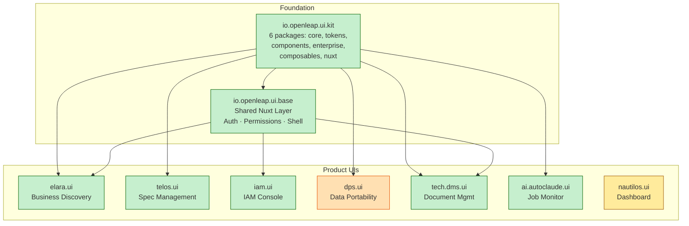

# OpenLeap Repository Landscape

Last updated: 2026-04-01

This document provides the complete inventory, dependency structure, and gap analysis for the OpenLeap ecosystem. For machine-readable metadata, see [REPO_CATALOG.yaml](REPO_CATALOG.yaml).

---

## Inventory Summary

| Category | Count | Active | Maintained | Stale/Archived |
|----------|-------|--------|------------|----------------|
| Specification | 1 | 1 | — | — |
| Backend — Foundation | 3 | 3 | — | — |
| Backend — Services | 26 | 13 | 8 | 5 |
| Frontend — Foundation | 3 | 2 | — | 1 |
| Frontend — Product UIs | 9 | 7 | 1 | 1 |
| Guidelines | 2 | 2 | — | — |
| Tooling | 9 | 8 | — | 1 |
| Infrastructure | 3 | 1 | 1 | 1 |
| **Total** | **56** | **37** | **10** | **9** |

---

## Backend Dependency Graph

All Java backend services share a common foundation through `io.openleap.parent` and `io.openleap.starter`.

```mermaid
flowchart TD
    subgraph Foundation
        PARENT[io.openleap.parent<br/>Maven BOM<br/>Java 25 / Spring Boot 4.0.2]
        STARTER[io.openleap.starter<br/>core-service 3.0.3-SNAPSHOT]
        NFS[io.openleap.common.nfs<br/>News Feed Starter]
    end

    PARENT --> STARTER
    PARENT --> NFS
    STARTER --> NFS

    subgraph IAM[IAM Services]
        PRINCIPAL[iam.principal]
        AUTHZ[iam.authz]
        TENANT[iam.tenant]
        AUDIT[iam.audit]
    end

    PARENT --> PRINCIPAL & AUTHZ & TENANT & AUDIT
    STARTER --> PRINCIPAL & AUTHZ & TENANT & AUDIT

    subgraph T1[Tier 1 — Platform]
        DMS[tech.dms<br/>Document Mgmt]
        REF[t1.ref<br/>Reference Data]
        CFG[t1.cfg<br/>Configuration]
        I18N[t1.i18n<br/>Internationalization]
        JC[t1.jc<br/>Job Control]
    end

    STARTER --> DMS
    PARENT --> REF & CFG & I18N & JC
    STARTER --> REF & CFG & I18N & JC

    subgraph T2[Tier 2 — Shared Business]
        BP[shared.bp<br/>Business Partner]
    end

    PARENT --> BP

    subgraph T3[Tier 3 — Domain Services]
        FIGL[fi.gl<br/>General Ledger]
        FIAP[fi.ap<br/>Accounts Payable]
        FIAR[fi.ar<br/>Accounts Receivable]
        FIACC[fi.acc<br/>Accounting Core]
        FIBANK[fi.bank<br/>Banking]
        FISLC[fi.slc<br/>Subledger Core]
        PURSUP[pur.sup<br/>Supplier Catalog]
    end

    PARENT --> FIGL & FIAP & FIAR & FIACC & FIBANK & FISLC & PURSUP
    STARTER --> FIGL

    subgraph Agora[Agora Platform]
        TELOS[telos<br/>Spec Management]
        TELOSAI[telos.ai<br/>AI Layer]
        ELARA[elara<br/>Discovery]
        NOA[noa<br/>AI Intelligence]
    end

    TELOS --> TELOSAI

    subgraph Other
        DPS[dps<br/>GDPR Portability]
    end

    classDef active fill:#c6efce,stroke:#006100
    classDef maintained fill:#ffeb9c,stroke:#9c5700
    classDef stale fill:#ffc7ce,stroke:#9c0006

    class PARENT,STARTER,NFS,PRINCIPAL,AUTHZ,TENANT,AUDIT,DMS,REF,CFG,I18N,JC,BP,FIGL active
    class TELOS,TELOSAI,FIAP,FIAR,FIACC,FIBANK,FISLC,PURSUP maintained
    class ELARA,NOA,DPS stale
```

### Notable Patterns

- **IAM cluster**: All 4 IAM services were updated in lockstep (2026-03-18), sharing the same parent + starter versions.
- **Agora services** (telos, noa, elara) use `spring-boot-starter-parent` directly instead of `io.openleap.parent`. This means they don't inherit the platform BOM and may drift on dependency versions.
- **tech.dms** also uses `spring-boot-starter-parent` directly (has a TODO to migrate).
- **Stale Agora backends**: `elara`, `noa`, and `dps` are not git repos — they exist as local development snapshots only.

---

## Frontend Dependency Graph

All product UIs share components from `ui.kit` and the application shell from `ui.base`.

### Notable Patterns

- **ui.base adoption is inconsistent**: Only `elara.ui`, `iam.ui`, and `tech.dms.ui` extend `ui.base`. Others (`telos.ui`, `dps.ui`, `ai.autoclaude.ui`) use `ui.kit` directly without the shared layer.
- **dps.ui** is still on Nuxt 3 (all others are on Nuxt 4).
- **nautilos.ui** uses Vite directly (not Nuxt) — it has its own mock backend (Elysia) and doesn't depend on the shared layer.
- **telos.ui** depends on `ui.kit` but not `ui.base` — it has its own auth and shell implementation.

---

## Specification Authority Map

Which specs live where and what is canonical.

**Canonical repo:** `io.openleap.dev.spec/` (the former `io.openleap.spec` is deprecated).

| Domain | Canonical Spec | Local Spec in Service Repo |
|--------|---------------|---------------------------|
| param/ref (T1) | `T1_Platform/param/domain-specs/param_ref-spec.md` | — |
| param/si (T1) | `T1_Platform/param/domain-specs/param_si-spec.md` | — |
| param/cfg (T1) | `T1_Platform/param/domain-specs/param_cfg-spec.md` | — |
| param/i18n (T1) | `T1_Platform/param/domain-specs/param_i18n-spec.md` | — |
| tech/dms (T1) | `T1_Platform/tech/domain-specs/tech_dms-spec.md` | `io.openleap.tech.dms/spec/` |
| tech/jc (T1) | `T1_Platform/tech/domain-specs/tech_jc-spec.md` | — |
| tech/nfs (T1) | `T1_Platform/tech/domain-specs/tech_nfs-spec.md` | — |
| tech/rpt (T1) | `T1_Platform/tech/domain-specs/tech_rpt-spec.md` | — |
| tech/zugferd (T1) | `T1_Platform/tech/domain-specs/tech_zugferd-spec.md` | — |
| tech/search (T1) | `T1_Platform/tech/domain-specs/tech_search-spec.md` | `io.openleap.tech.search/` (planned) — supersedes `crm.search` |
| tech/email (T1) | `T1_Platform/tech/domain-specs/tech_email-spec.md` | `io.openleap.tech.email/` (planned) — supersedes `crm.email` |
| tech/ai (T1) | `T1_Platform/tech/domain-specs/tech_ai-spec.md` | `io.openleap.tech.ai/` (planned, new) |
| iam/* (T1) | `T1_Platform/iam/domain-specs/` | `io.openleap.iam.*/` (per service) |
| shared/bp (T2) | `T2_Common/domain-specs/shared_bp-spec.md` | `io.openleap.shared.bp/` |
| shared/cap (T2) | `T2_Common/domain-specs/shared_cap-spec.md` | `io.openleap.shared.cap/` (planned) |
| auto/ntf (T2) | `T2_Common/domain-specs/auto_ntf-spec.md` | `io.openleap.auto.ntf/` (active, renamed 2026-04-29 from `io.openleap.shared.ntf`) — supersedes `crm.ntf` |
| auto/wf (T2) | `T2_Common/domain-specs/auto_wf-spec.md` | `io.openleap.auto.wf/` (active, renamed 2026-04-29 from `io.openleap.shared.wf`) — supersedes `crm.wf` |
| fi/* (T3) | `T3_Domains/FI/` | per service |
| crm/* (T3) | `T3_Domains/CRM/` | `io.openleap.crm.*/` (see CRM suite header for DEPRECATED entries) |
| tks/tkt (T3) | `T3_Domains/TKS/domain-specs/tks_tkt-spec.md` | `io.openleap.tks.tkt/` (planned) |
| tks/ch (T3) | `T3_Domains/TKS/domain-specs/tks_ch-spec.md` | `io.openleap.tks.ch/` (planned) |
| tks/kb (T3) | `T3_Domains/TKS/domain-specs/tks_kb-spec.md` | `io.openleap.tks.kb/` (planned) |
| tks/cmdb (T3) | `T3_Domains/TKS/domain-specs/tks_cmdb-spec.md` | `io.openleap.tks.cmdb/` (planned) |
| hr (T3) | `T3_Domains/HR/` | per service |
| pps/* (T3) | `T3_Domains/PPS/` | per service |
| sd (T3) | `T3_Domains/SD/` | per service |
| ps (T3) | `T3_Domains/PS/` | per service |
| srv (T3) | `T3_Domains/SRV/` | `io.openleap.srv.*/` |
| bi (T4) | `T4_Data/bi/` | — |
| telos | `concepts/CONCEPTUAL_STACK.md` | `io.openleap.telos/spec/` |
| elara | `concepts/CONCEPTUAL_STACK.md` | `io.openleap.elara/spec/` |

**Rule:** `io.openleap.dev.spec/` is the canonical source for all domain specifications. Service repos may contain derived OpenAPI specs for development convenience, but the spec repo takes precedence on conflicts.

**Deprecated (superseded — grace period 2026-Q3 → Q1-2027):**
- `crm.ntf` → `auto.ntf` (T2 Common — was promoted to `shared.ntf` first, renamed to `auto.ntf` in the T2 suite split 2026-04-21)
- `crm.wf` → `auto.wf` (T2 Common — idem)
- `crm.search` → `tech.search`
- `crm.email` → `tech.email`
- `crm.sup` → `tks.tkt` + `tks.kb`

See `T3_Domains/TKS/_tks_suite.md` ADR-TKS-005 for the promotion rationale.

---

## Gap Analysis

### Repos Without Specs

These active service repos have no corresponding specification in `io.openleap.spec/spec/`:

| Repo | Expected Spec Location | Priority |
|------|----------------------|----------|
| `io.openleap.iam.principal` | `spec/T1_Platform/IAM/iam_principal.md` | High |
| `io.openleap.iam.authz` | `spec/T1_Platform/IAM/iam_authz.md` | High |
| `io.openleap.iam.tenant` | `spec/T1_Platform/IAM/iam_tenant.md` | High |
| `io.openleap.iam.audit` | `spec/T1_Platform/IAM/iam_audit.md` | High |
| `io.openleap.common.nfs` | N/A — shared Java library, not a domain service | — |
| `io.openleap.dps` | `spec/T1_Platform/dps/` | Low (stale) |

### Specs Without Repos

These domains are specified but have no implementation repo:

| Spec | Expected Repo | Notes |
|------|--------------|-------|
| `spec/T3_Domains/PPS/pps_mrp.md` | `io.openleap.pps.mrp` | Not yet started |
| `spec/T3_Domains/PPS/pps_aps.md` | `io.openleap.pps.aps` | Not yet started |
| `spec/T3_Domains/PPS/pps_qm.md` | `io.openleap.pps.qm` | Not yet started |
| `spec/T3_Domains/PPS/pps_eam.md` | `io.openleap.pps.eam` | Not yet started |
| `spec/T3_Domains/FI/fi_ap.md` | `io.openleap.fi.ap` | Not yet started |
| `spec/T3_Domains/FI/fi_ar.md` | `io.openleap.fi.ar` | Not yet started |
| `spec/T3_Domains/FI/fi_tax.md` | `io.openleap.fi.tax` | Not yet started |
| `spec/T3_Domains/SD/*` | `io.openleap.sd.*` | Not yet started |
| `spec/T3_Domains/HR/*` | `io.openleap.hr.*` | Not yet started |
| `spec/T4_Data/bi/` | `io.openleap.bi` | Not yet started |

### Stale/Archived Repos

| Repo | Reason | Recommendation |
|------|--------|----------------|
| `io.openleap.shared.bp.old` | Superseded by `io.openleap.shared.bp` | Archive or delete |
| `io.openleap.fi.gle` | Superseded by `io.openleap.fi.gl` (Java 21 → 25) | Archive or delete |
| `io.openleap` | Legacy monorepo structure | Investigate, likely archive |
| `io.openleap.iac.ui` | Empty repo | Delete or repurpose |
| `io.openleap.ui.starter` | Docker scaffolding, not a git repo | Decide: integrate into docs or delete |
| `io.openleap.infra` | Minimal content, not a git repo | Merge into `io.openleap.k8s` or delete |
| `io.openleap.telos.cli` | Not a git repo | Decide: revive or delete |

### Naming Inconsistencies

| Pattern | Expected | Actual | Repos Affected |
|---------|----------|--------|----------------|
| Parent POM usage | All Java services use `io.openleap.parent` | `tech.dms`, `telos`, `telos.ai`, `noa`, `elara`, `dps` use `spring-boot-starter-parent` | 6 repos |
| ui.base adoption | All product UIs extend `ui.base` | `telos.ui`, `dps.ui`, `nautilos.ui`, `ai.autoclaude.ui` do not | 4 repos |
| Nuxt version | All UIs on Nuxt 4 | `dps.ui` still on Nuxt 3 | 1 repo |
| IAM API path | `/api/t1/iam/*/v1` (tier-based) | `/api/v1/iam/principals` (version-first) | 4 IAM repos |

---

## Technology Stack Matrix

### Backend

| Component | Version | Managed By |
|-----------|---------|------------|
| Java | 25 | `io.openleap.parent` |
| Spring Boot | 4.0.2 | `io.openleap.parent` |
| Spring Cloud | 2025.1.1 | `io.openleap.parent` |
| PostgreSQL | 16 | Per service |
| RabbitMQ | 4.x | Per service |
| MongoDB | 7.x | Agora services only |
| Neo4j | 5.x | Agora services only |
| Milvus | 2.4.x | Agora services only |
| Keycloak | 26.x | IAM integration |
| Spring AI | 2.0.0-M2 | Agora AI services |

### Frontend

| Component | Version | Managed By |
|-----------|---------|------------|
| Vue | 3.5+ | `io.openleap.ui.kit` |
| Nuxt | 4.x | Per product UI |
| TypeScript | 5.7–5.9 | Per product UI |
| Tailwind CSS | 4 | `io.openleap.ui.kit` |
| Shadcn-Vue | Latest | `io.openleap.ui.kit` |
| TanStack Query/Table | Latest | `io.openleap.ui.base` |
| Keycloak (oidc-spa) | Latest | `io.openleap.ui.base` |
| pnpm | 9.x | All frontend repos |

### AI/Automation

| Component | Version | Used By |
|-----------|---------|---------|
| Claude Code CLI | Latest | `nightagent`, `ai.autoclaude` |
| Anthropic Claude API | Latest | `noa`, `telos.ai` |
| FastAPI | 0.115+ | `ai.autoclaude` |
| Python | 3.12 | `ai.autoclaude`, `nightagent` |
